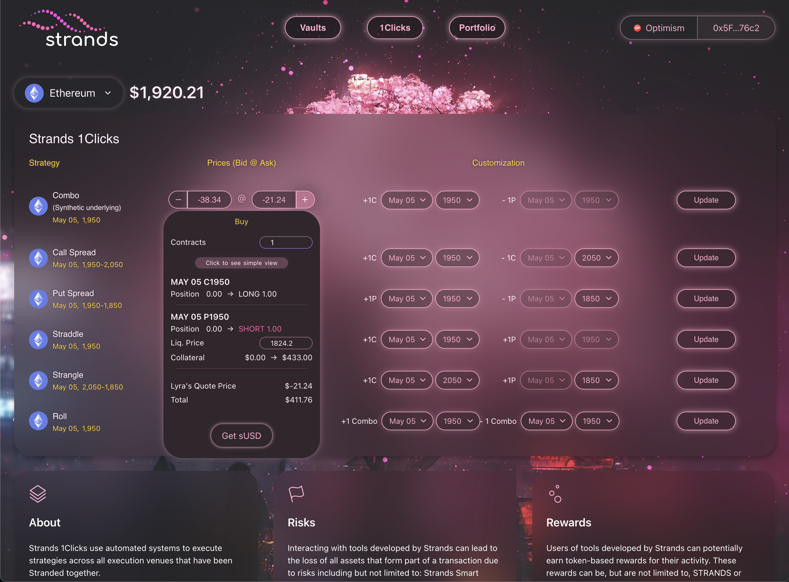
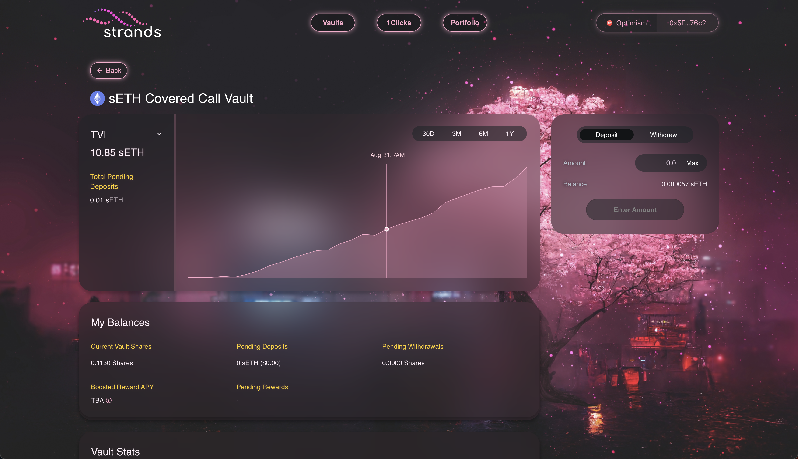

# strands-interface

## Table of Contents

- [1. Project Description](#1-project-description)
- [2. Basic Project Showcase (images)](#2-basic-project-showcase-images)
  - [2.1. 1Clicks (or "one-clicks") page](#21-1clicks-or-one-clicks-page)
  - [2.2. Options vaults](#22-options-vaults)
- [3. Broken Git tree and corrupted objects](#3-broken-git-tree-and-corrupted-objects)
  - [3.1. "Most visible" branch](#31-most-visible-branch)
  - [3.2. Cleanly exportable branches](#32-cleanly-exportable-branches)
- [4. Authors](#4-authors)

## 1. Project Description

A user interface (UI) for the [Strands](https://strands.finance) options trading platform with last Git commit added Wednesday, April 19, 2023.

The "most visible" branch's code, i.e. the code that you see on this repository, comes from the original `feat/arbitrum` branch -- a thorough explanation for what that means is described in section [3. Broken Git tree and corrupted objects](#3-broken-git-tree-and-corrupted-objects).

## 2. Basic Project Showcase (images)

I no longer have access to the user interface (UI) so here are screenshots of two separate pages that I have saved from the Strands `interface` repository from when I last worked on the project.

Note that the entire user interface was designed and coded by me, [platocrat](https://github.com/platocrat).

### 2.1. 1Clicks (or "one-clicks") page

<div align="center">
  
  <caption>
    Designed and coded by me:
    <br />
    <em>
      Source:
      <a href="https://strands.finance">
        https://strands.finance
      </a>
    </em>
    <br />
    <br />
  </caption>
</div>

1Clicks page that let options traders trade Strands multi-leg  options strategies via a "one-click" Ethereum smart contract. Options strategies included Synthetic Underlying, Call or Put Spreads, Straddles, Strangles, and Calendar Rolls. In the image, a trade window shows the user attempting to go long (denoted by the `+` sign) 1 Combo options strategy which has two legs, 1 May 5th Call and 1 May 5th Put, at the same $1950 strike. A liquidation price is displayed along with the amount of collateral needed to support the position. At the end of this trade window, a quote price set by the Lyra protocol is displayed along with the calculated total cost to buy this options strategy. All of these options strategies were fully operational in production.

### 2.2. Options vaults

<div align="center">
  
  <caption>
    Designed and coded by me:
    <br />
    <em>
      Source:
      <a href="https://strands.finance">
        https://strands.finance
      </a>
    </em>
    <br />
    <br />
  </caption>
</div>

Strands' options vaults that allowed users to invest in a "vault", an automated investment vehicle that trades a specified options strategy with a specific underlying token or pairs of tokens. In the image, the options vault being displayed is trading Covered Call strategies with an sETH underlying. The page also displays the yearly Total Value Locked (TVL), Total Pending Deposits, and user balances across the currently viewed options vault. Deposits and withdrawals from any of the 4 listed options vault were fully functional and operating in production.

## 3. Broken Git tree and corrupted objects

This repository still holds the original GitHub repository as a compressed `strands-interface.zip` file. However, this original repository has multiple corrupted files that exist, namely present within the following branches:

- `feat/arbitrum`
- `feat/chatgpt`
- `rors`

Since these corrupted files contain the original commit history **and** because the original Git commit history is still somehow salvageable even with these corrupted files, I have left this compressed version of the repository so that either I or someone else may recover the original Git commit history at a later date.

### 3.1 "Most visible" branch

Nonetheless, the "most visible" code that is present on this repository comes from the Wednesday, April 19, 2023 commit from the `feat/arbitrum` branch, which completely allows for the switching between the [Arbitrum](https://arbitrum.io) and [Optimism](https://optimism.io) L2 networks to trade cryptocurrency options on Lyra (now known as [Derive](http://derive.xyz/)) options protocol on [Optimism](https://optimism.io).

The `feat/chatgpt` and `rors` branches have, since Wednesday, April 19, 2023, become corrupted and are unrecoverable without rigorous restorative Git commit procedures. Thus, these rigorous restorative Git procedures will be performed at a later time, either by me or by someone else.

### 3.2. Cleanly exportable branches

I have tried using OpenAI's ChatGPT to salvage these broken commits from the original commit history, but had a lot of trouble with getting multiple different Git error messages, chiefly:

```zsh
fatal: unable to read tree <SHA_HASH>
```

Access to the original ChatGPT conversation is provided at the link below:
- ["Git push error fix" (ChatGPT discussion from March 23, 2025)](https://chatgpt.com/share/6830bdcb-5c94-8011-b08d-ab95302539be)

<!-- ## Local development

Install dependencies and start the development environment by running:

```bash
npm i && npm run start
``` -->

## 4. Authors

[@platocrat](https://github.com/platocrat)
